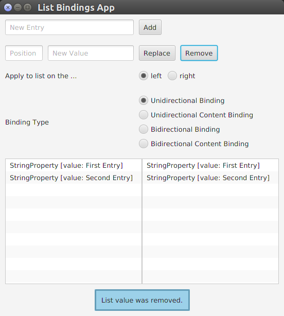

# list-change-and-binding-issues
In this repository you will find a simple application (with GUI) that visualizes issues on bindings and changes on list properties.
-----
In the list_bindings package you will find an AppStarter class that starts the list bindings app.

In the started app you can manipulate two lists whereas you have differnent options to do that.

You can choose between ...
* different binding types of the lists.
* modifying the left or the right list.
* adding, replacing or updating a list element.

